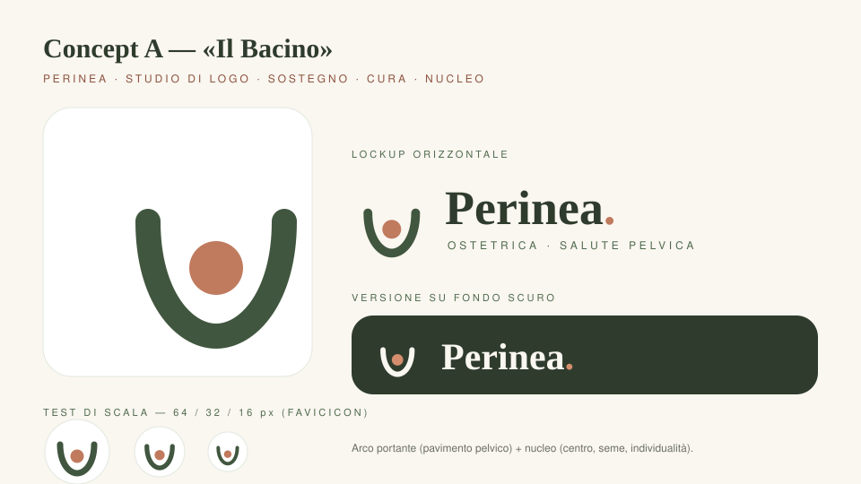
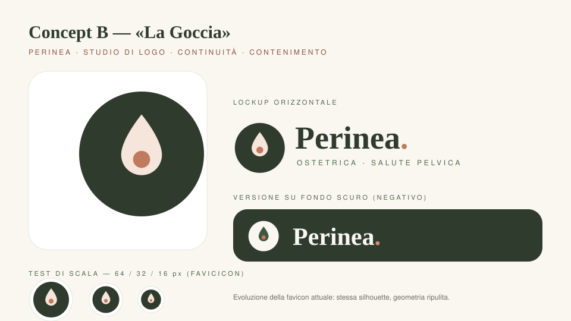
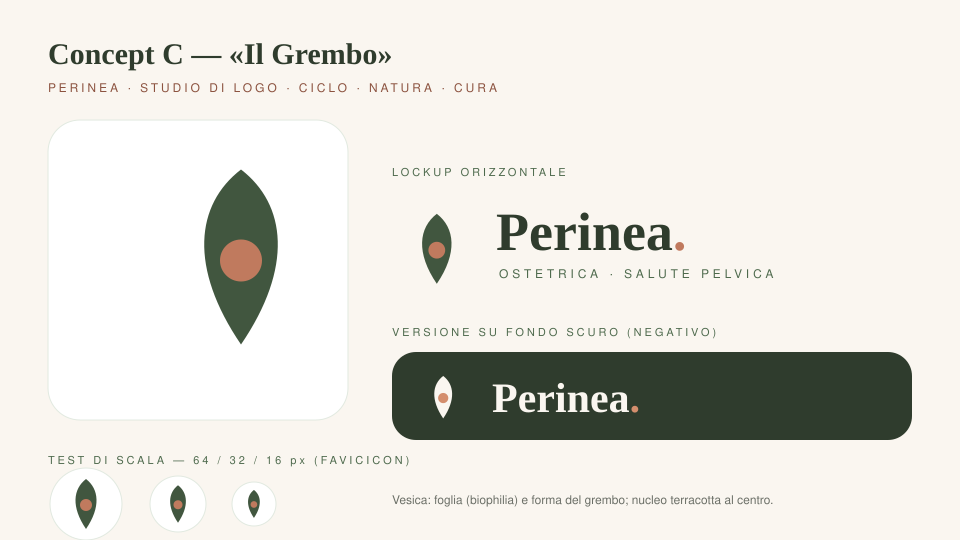

# Perinea — Studio di brand, formato e logo su base scientifica

**Cliente:** Dott.ssa Isabel Lombardini · Ostetrica, salute pelvica della donna
**Marca:** Perinea — clinica Native Medica (Casalecchio di Reno · San Lazzaro di Savena, BO)
**Autore del documento:** senior web designer / stratega di marca — revisione delle fonti scientifiche: proprie (verificate su database primari)
**Data:** 28 settembre 2026

---

## Sintesi esecutiva

Questo documento fa tre cose, nell'ordine richiesto:

1. **Audita il brand e il formato esistente** (sito Next.js, design system, copy, identità visiva) evidenziando — con dati misurati — cosa funziona e cosa no.
2. **Propone un formato** (architettura di pagina + design system) e **tre concept di logo** coerenti con i quattro gruppi di servizi offerti, allegati come file SVG in [`brand/logo/`](../brand/logo/).
3. **Fonda ogni scelta su letteratura peer-reviewed** di marketing science e neuroscienze, con **livello di evidenza esplicito** per ciascun principio e una sezione dedicata a ciò che la scienza **non** supporta (debunking).

Tre finding dell'audit, anticipati:

| Problema misurato | Dato | Impatto |
|---|---|---|
| Testo eyebrow terracotta (`terracotta-600` su cream) | contrasto **4,23:1** — sotto AA (min. 4,5:1 per testo < 18,66px) | fallimento WCAG 1.4.3 su ogni sezione |
| Pulsante accento bianco su `terracotta-500` | contrasto **3,39:1** | CTA principali non conformi |
| Metrica highlight «30/30» | numerale opaco fuori contesto | carico di elaborazione, zero valore persuasivo |
| Logo = solo wordmark testuale «Perinea.» + favicon disgiunta | nessun *mark* riconoscibile a 16px nel contesto header | manca un asset distintivo proprietario (Sharp, 2010) |

**Raccomandazione di marca in una riga:** mantenere il nome *Perinea* (unicità e riemergenza categoriale), adottare il **Concept A «Il Bacino»** con lockup orizzontale e continuità del «punto» terracotta come DNA distintivo, e applicare il formato a 7 blocchi con le correzioni di contrasto e di copy prima di ogni altro intervento.

---

## 0. Metodologia e legenda dell'evidenza

- **Ambito:** osservazionale sul codice sorgente del repository (pagine, componenti, `tailwind.config.ts`, `lib/*.ts`, immagini) — nessun accesso ad analytics o utenti reali.
- **Standard:** ogni principio scientifico citato riporta autori, anno, rivista; la **forza dell'evidenza** è marcata:

| Tag | Significato |
|---|---|
| **● Forte** | meta-analisi, replicazioni estese o studi convergenti robusti |
| **◐ Moderata** | evidenza sostanziale con limiti (contesto, campioni, potenza, generalizzabilità) |
| **○ Debole / contestata** | risultati misti o replicazioni fallite — usata solo con avvertenza esplicita |
| **△ Consenso di mestiere** | principio strutturale/standard (WCAG, tipografia) senza sperimentazione controllata dedicata; segnalato come tale |

- **Disciplina auto-imposta:** nessun claim «il colore X aumenta le vendite del Y%», nessun uso improprio di termini neuroscientifici. I fallimenti di replicazione noti (Williams & Bargh sulla calura; Kosfeld sull'ossitocina; effetti del rosso sulla cognizione) sono riportati invece che nascosti: uno studio «esclusivamente su base scientifica» deve includere la *critica* della scienza.

---

## 1. Audit del brand esistente

### 1.1 Il brand in sintesi

| Voce | Contenuto (da `lib/site.ts`, `lib/services.ts`, README) |
|---|---|
| Nome | **Perinea** (dal perineo — denominazione anatomica) |
| Professionista | Dott.ssa Isabel Lombardini, ostetrica, 15+ anni ospedale/ASL, specializzazione 30/30 in salute pelvica (2025) |
| Sede | Clinica Native Medica, due punti (BO) |
| Servizi (4 gruppi) | ① Pavimento pelvico e salute ginecologica ② Ostetricia e post-parto ③ Screening e prevenzione ④ Corsi pre-parto |
| Canali | Telefono diretto, WhatsApp (form → chat precompilata), modulo |
| Promessa (tagline) | «Al fianco delle donne: gravidanza, parto, post-parto e salute del pavimento pelvico» |
| Tono | Prima persona, caldo, «senza fretta», filosofia di prossimità |

### 1.2 Il formato attuale (struttura e componenti)

- **Template:** header sticky → hero 2 colonne (copy + ritratto con badge sede) → fascia highlight 4 metriche → griglia 4 servizi → teaser «Chi sono» → focus pavimento pelvico (sintomi + tecnologia) → CTA banner → footer.
- **Pagine:** Home, Chi sono (timeline milestone), Servizi (listino a card + disclaimer), Contatti (telefono, sedi, form WhatsApp).
- **Design system:** palette cream/sand/ink + scala *sage* + scala *terracotta*; tipografia **Cormorant Garamond** (display) + **Nunito Sans** (testo), self-hosted; raggi generosi (24–40px); ombre «soft»; componenti `card`, `btn-*`, `eyebrow`, `container-site` (max-w-6xl).
- **Copy:** prima persona singolare, CTA «Chiamami · 347…», normalizzazione dei sintomi («può valere la pena parlarne»), prezzi pubblicati con disclaimer.

### 1.3 Identità visiva attuale

- **Wordmark:** «Perinea» in Cormorant semibold + punto terracotta. È un *logotype puro*: nessun simbolo distintivo.
- **Favicon** (`public/images/favicon.svg`): cerchio verde (`#41563F`) + goccia/forma petalo crema + punto terracotta al centro — **disgiunta dall'header**: nel sito non appare mai.
- **Immagini:** ritratto professionale, foto gravidanza, illustrazione botanica zona pelvica.

### 1.4 Punti di forza (evidence-based)

1. **Congruenza categoria forte:** verde-salvia (natura/ripristino), terracotta (calore umano, non «bianco clinico»), forme arrotondate, serif editoriale → package coerente con i principi di congruenza logo/brand (Henderson & Cote, 1998 ◐) e con la *processing fluency* (Reber, Schwarz & Winkielman, 2004 ●).
2. **Faccia della professionista in hero** — la presenza del volto è allineata alla cognizione sociale (le facce catturano l'attenzione in modo prioritario: Brosch, Sander & Scherer, 2007 ◐) e alla letteratura sulla credibilità della fonte (Hovland & Weiss, 1951 ●; Stewart, 1995 ● per la comunicazione medico-paziente).
3. **CTA primaria = chiamata vocale**, con riduzione di attrito (il form genera una chat WhatsApp precompilata → maggiore *ability* nel modello B=MAP di Fogg, 2009 ◐).
4. **Prezzi trasparenti** → riduce l'avversità all'ambiguità (Ellsberg, 1961 ●) e previene il giudizio di unfairness nel pricing (Bolton, Warlop & Alba, 2003 ◐).
5. **Prima persona e microcopy caldo** → disclosure reciproca e affetto (meta-analisi: Collins & Miller, 1994 ●); parassocialità positiva (Horton & Wohl, 1956 △).
6. **Quattro servizi in griglia** → allineato al limite operativo della memoria di lavoro (≈4±1 elementi per chunk: Cowan, 2001 ●).

### 1.5 Punti deboli (audit tecnico e cognitivo)

**A. Accessibilità — contrasti WCAG 2.1 (calcolati via relative-luminance sulle HEX reali):**

| Elemento (codice) | Coppia | Ratio | Requisito AA | Esito |
|---|---|---|---|---|
| `.eyebrow` (`terracotta-600` su cream) | `#A96449` / `#FAF6F0` | **4,23** | 4,5 | ✗ |
| `.btn-accent` (bianco su `terracotta-500`) | `#FFFFFF` / `#C07A5E` | **3,39** | 4,5 | ✗ |
| Pulsante telefono footer (bianco su `terracotta-500`) | idem | **3,39** | 4,5 | ✗ |
| Highlight label `text-ink/65` | `#747770` / cream | **4,23** | 4,5 | ✗ |
| Note servizi `text-ink/55` | `#898B84` / cream | **3,20** | 4,5 | ✗ |
| Disclaimer listino `text-ink/50` | `#93948E` / cream | **2,84** | 4,5 | ✗ |
| Placeholder input `ink/40` | `#A8A8A1` / cream | **2,22** | 4,5 | ✗ |
| Testo body `ink/75`, `ink/70` | 5,61 / 4,83 | ≥4,5 | ✓ |
| `btn-primary` cream su `sage-700` | 7,42 | 4,5 | ✓ |

Correzioni minime: eyebrow → `terracotta-700` (5,69); sfondo `.btn-accent` → `terracotta-600` (4,56) o `terracotta-700` (6,13); alfa del testo mutuo ≥ 0,70; placeholder a `ink/60`+ con hint persistente.
△ Il supporto normativo (WCAG) è standard; il *costo cognitivo* del testo a basso contrasto è documentato dalla ricerca di leggibilità (Tinker, 1963 ●; Rayner, 1998 ●).

**B. Copy e cognizione:**

- «30/30» come numerale di highlight: senza etimologia («specializzazione con voto massimo») è un *non-segnale* — viola il principio di fluency semantica (Reber et al., 2004 ●). Riformulare: *«2025 · Specializzazione in salute pelvica, 30/30»* (isola la parte persuasiva con l'effetto isolato di von Restorff, 1933 ◐ applicato all'etichetta).
- «VTONE» esposto come se fosse noto a tutti: termine tecnico non ancora elaborato → richiede glossa immediata (il sito la dà, ma solo a pagina servizi — fuori dal chunk giusto).
- Assenza di **riempitivo di prova** (credenziali sintetizzate in hero, tempi di risposta, «prima visita: un'ora con te») — l'autorità c'è ma è dispersa nella timeline.

**C. Marca visiva:**

- Il wordmark puro «Perinea.» è elegante ma **non differenziabile per forma**: nelle miniature/schedulerie (MioDottore, Google Business, favicon dei tab) compete con logotipi serif generici → bassa *distinctività* = bassa riemergenza in memoria (Sharp, 2010 ●; per i loghi: Henderson & Cote, 1998 ◐).
- La favicon esistente **non è mai usata come mark**: c'è un asset potenziale (badge goccia) abbandonato — spreco di esposizioni (l'effetto mere-exposure rende familiare ciò che si ripete: Zajonc, 1968 ●, ma solo se *ripetuto coerentemente*).

**D. Lezione dal dato utente di riferimento (letteratura, non analytics):** per disturbi stigmatizzati del pavimento pelvico, imbarazzo e vergogna sono la barriera n.1 al ricorso (revisione sistematica: Jouanny, Abhyankar & Maxwell, 2024 ◐; Almajed et al., 2025 ◐: imbarazzo 33,3% dei partecipanti; solo ~38% delle donne con incontinenza ne parla col medico — Kasper et al. cit. in letteratura). **Implicazione progettuale:** l'estetica deve essere *rassicurante e discreta*, mai clinica-cold, mai allarmistica; il canale WhatsApp (testuale, asincrono, «senza guardare in faccia nessuno») è un vantaggio competitivo da esplicitare nel copy.

### 1.6 Il problema del nome «Perinea»

- **Pro:** denominazione anatomica esatta → massima congruenza con la categoria (aiuta il richiamo: la memoria è organizzata per categorie, Hinrichs & Barth, 1968 ◐; «perinea/pavimento pelvico» = category entry point irrinunciabile per la ricerca locale — Sharp, 2010 ●).
- **Contro:** il termine può attivare imbarazzo o distanza «medicale» in un pubblico già sensibile (Jouanny et al., 2024 ◐).
- **Decisione:** **si mantiene il nome**; lo «addolcisce» il *format* (volto, first person, forme tonde, palette calda) — divisione del lavoro fra nome (chiarezza) e design (affetto).

---

## 2. Positioning e coerenza con i servizi

**Posizionamento (bozza operativa):**
> Perinea è la pratica di prossimità di Dott.ssa Isabel Lombardini dove le donne tornano a sentirsi *sicure nel proprio corpo* — dal pavimento pelvico al post-parto — con percorsi personalizzati, tecnologia visibile (biofeedback/VTONE) e ascolto senza fretta.

**Mappa servizi → semantica visiva** (base per il logo):

| Gruppo servizi | Funzione nel corpo/ciclo | Metafore ammesse | Da evitare |
|---|---|---|---|
| ① Pavimento pelvico | **sostegno** (hammock/sling che tiene gli organi) | arco, culla, bacino, rete | forme taglienti; icona «donna in bianco» |
| ② Ostetricia/post-parto | **grembo, gravidanza, cura** | vesica, foglia, curva ampia, seme | cuori cliché, emoji mediche |
| ③ Screening | **protezione, continenza** | scudo morbido, goccia *contenuta* | rosso-allarme, croci |
| ④ Corsi di coppia | **insieme, trasmissione** | due curve parallele, cerchio condiviso | sole/arcobaleno generici |

I quattro gruppi convergono su un **nucleo semantico comune: «tenere/supportare/contenere con delicatezza»**. È il vincolo di design del logo.

---

## 3. Il FORMAT — specifica progettuale con evidenza

### 3.1 Architettura di pagina (template a 7 blocchi)

| # | Blocco | Funzione persuasiva | Principio scientifico |
|---|---|---|---|
| 1 | **Hero**: eyebrow identità → H1 promessa → beneficio → CTA doppia (chiamata primaria + servizi) → ritratto con badge sede | Prima impressione + prompt | Prima impressione estetica in ≈50 ms (Lindgaard et al., 2006 ● — *sull'appello visivo*, non sulla fiducia in sé); volti prioritari nell'attenzione (Brosch et al., 2007 ◐); prompt vicino al motivo (Fogg, 2009 ◐) |
| 2 | **Fascia prova** (max 4 riquadri): anni, specializzazione datata, tecnologia, sedi | Autorità compressa | Effetto isolato + limiti di chunk (Cowan, 2001 ●; von Restorff, 1933 ◐); autorità = principio di influenza (Cialdini, 2001 ◐; Milgram, 1963 ● *eticamente filtrato*: solo credenziali vere) |
| 3 | **Servizi** (4 card, prezzo a pillola) | Orientamento, trasparenza | 4±1 chunk (Cowan, 2001 ●); prezzo visibile = meno ambiguità (Ellsberg, 1961 ●) e più fairplay percepito (Bolton et al., 2003 ◐) |
| 4 | **Focus disturbo**: sintomi → normalizzazione → soluzione | Identificazione + autoricorrenza | Il lettore riconosce il proprio stato (*pictorial/concreteness superiority*: Paivio, 1971 ◐); messaggio ad alta efficacia risposta + minaccia moderata = percorso «danger control» (Witte, 1992 ●) |
| 5 | **Chi sono**: timeline brevi + citazione filosofica | Fonte, credibilità | Credibilità fonte (Hovland & Weiss, 1951 ●); disclosure personale → affetto (Collins & Miller, 1994 ●) |
| 6 | **Percorso in 3 step** (colloquio → valutazione → piano) | Riduzione incertezza | Trasparenza del processo riduce l'avversità all'ambiguità (Ellsberg, 1961 ●); goal-gradient: progresso visibile motiva (Kivetz, Urminsky & Zheng, 2006 ●) |
| 7 | **CTA finale** ripetuta (voice + WhatsApp) | Prompt reiterato | Ripetizione → familiarità → preferenza (mere exposure: Zajonc, 1968 ●); step successivo a costo minimo (B=MAP: Fogg, 2009 ◐) |

**Navigazione:** 4 voci (invariata) — rispetta Hick (1952 ◐) e la legge empirica: voci ≤ 5-7 per menu locale. Non aggiungere voci.

### 3.2 Griglia e ritmo

- Contenitore `max-w-6xl` (1152px), padding 20/32px — mantenere.
- **Lunghezza di riga:** target 62–68 caratteri per riga nei blocchi di testo lunghi (l'ampiezza della fovea per la lettura è ≈17-20 caratteri per fixazione; le righe lunghe moltiplicano i *regressi*: Rayner, 1998 ●).
- Spaziatura a multipli di 8 (base 8pt) — △ standard; regola il carico visivo e la scansionabilità (complessità visiva degrada prima impressione e credibilità percepita: Tuch et al., 2009 ◐; Tuch et al., 2012 ◐).
- Radii: **pillole (9999)** per azioni, **3xl (24px)** per card, **2,5rem (40px)** per media — mantenere: nessun angolo vivo nel sistema (vedi §5.4, Bar & Neta, 2006/2007 ●).

### 3.3 Tipografia

| Ruolo | Font | Perché | Evidenza |
|---|---|---|---|
| Display / H1-H3 | Cormorant Garamond (serif alto contrasto) | persona «curata, calda, autorevole» del serif; estetica editoriale = competenza percepita | Il *pairing* funziona per **congruenza di personalità** tra font e testo, non per leggibilità intrinseca (Brumberger, 2003 ●; Shaikh, Chaparro & Fox, 2006 ◐) |
| Testo / UI | Nunito Sans (sans umano, terminali morbidi) | leggibilità schermo a corpo piccolo; persona amichevole | Nessuna differenza di leggibilità serif/sans (meta-ricerca: Tinker, 1963 ●; conferme successive) → la scelta è *retorica*, non ergonomica: va giustificata a carattere |
| Eyebrow | 0.7rem, tracking 0.22em, maiuscoletto | gerarchia + ritmo | Tenere **solo per etichette ≤ 3-4 parole**: il maiuscolo prolungato riduce la velocità di lettura delle parole familiari (forme lessicali minuscole/miste più rapide: Tinker, 1963 ◐) |
| Scala | H1 3,4rem/4xl-5xl · H2 3xl-4xl · body 16-18px · caption 12-14px | rapporto ≈1,25-1,33 fra gradi | △ scala tipografica modulare; corpo minimo 16px (WCAG 1.4.4 zoom, leggibilità: Rayner, 1998 ●) |

**Correzioni obbligatorie:** eyebrow → `terracotta-700`; `text-ink/55` → `ink/70`+; disclaimer non sotto `ink/70`.

### 3.4 Colore — ruoli funzionali (non «psicologia del colore»)

> Avvertenza scientifica: gli effetti del colore sono **contestuali** (Elliot & Maier, 2014 ● color-in-context); la meta-analisi di Gnambs (2020 ●) non trova evidenza dell'effetto «rosso→prestazioni cognitive»; le replicazioni del «calore fisico→calore sociale» (Williams & Bargh, 2008) sono **fallite** (2014, doi:10.1027/1864-9335/a000187; 2018, doi:10.1027/1864-9335/a000361). Usiamo quindi il colore per **funzione identitaria, contrasto e coerenza categoria**, non per claim causali.

| Ruolo | Token | Uso | Nota |
|---|---|---|---|
| Neutro caldo | `cream #FAF6F0`, `sand #F2EBE1` | fondo, respiro | non-bianco = non-ospedaliero (decisione estetica, non terapeutica) |
| Primario | scala `sage` | superfici, bottoni, footer | congruenza con biophilia/ripristino (Kaplan, 1995 ●; Wilson, 1984 ◐): la scena naturale riduce il recupero dell'attenzione; usare *fotografie* di natura/luce, non solo il verde come tinta |
| Accento | scala `terracotta` | CTA, enfasi, «punto» del logo | **solo `terracotta-600/700` per testo** (4,56-5,69:1); `terracotta-500` solo come riempimento grafico o sfondo di testo bianco ≥18,66px |
| Testo | `ink #2C332B` (12,07:1) / `ink/70` (4,83:1) | body | alfa minima 0,70 su cream |
| Selezione | `terracotta-200` bg + ink (8,55:1) | `::selection` | ✓ |

### 3.5 Fotografia e illustrazioni

1. **Ritratto in hero:** volto = richiamo attentivo prioritario (Brosch et al., 2007 ◐); sguardo dritto o verso la copy; luce naturale; sfondo non-«studio» freddo. Espressione calda: le valutazioni di *trustworthiness* dai volti sono immediate e potenti, ma sono **inferenze istantanee fallaci** (Todorov et al., 2005 ●; revisione con caveats: Todorov, Olivola, Dotsch & Mende-Siedlecki, 2015 ●) — si lavora *con* il meccanismo (espressione accessibile) senza finti «volti stock» che inquinerebbero l'autenticità.
2. **Immagini naturali/botaniche** (già presenti): coerenti con l'effetto restaurativo dei contesti naturali (Ulrich, 1984 ●; Kaplan, 1995 ●) — verificare che siano immagini *della persona o del contesto reale* dove possibile (specificità → memoria).
3. **Superiorità della figura:** le immagini elaborate semanticamente si ricordano meglio del testo isolato (codifica doppia: Paivio, 1971 ●; picture superiority in associazioni: Hockley, 2008 ●) → ogni sezione resta a testo+immagine, non testo nudo.
4. **Alt text descrittivo** (accessibilità + SEO): attuale buono; mantenere.

### 3.6 Componenti

- **`.eyebrow`** — etichetta di sezione; colore `terracotta-700`.
- **`.btn-primary`** (sage-700/cream, 7,42:1) — CTA vocale. **`.btn-accent`** → spostare su `terracotta-600` (4,56:1) — oppure mantenere `terracotta-500` con testo ≥18,66px bold.
- **Card servizio** — prezzo sempre visibile; hover `translate-y` morbido (nessun parallasse obbligatorio; rispettare `prefers-reduced-motion` per le transizioni non essenziali — △ WCAG 2.3.3).
- **Form → WhatsApp precompilato** — pattern da conservare: riduce i passi (ability) e mantiene il prompt sulla piattaforma già familiare (Fogg, 2009 ◐; micro-convenienza: foot-in-the-door, Freedman & Fraser, 1966 ◐ per step progressivi).
- **Microcopy:** prima persona («ti rispondo io, senza filtri e senza fretta») — mantenere ovunque; disclosure → preferenza (Collins & Miller, 1994 ●).

### 3.7 Tabella decisione → evidenza (sintesi del formato)

| Decisione | Principio | Forza |
|---|---|---|
| Hero 2 colonne con volto | attenzione ai volti + prima impressione rapida | ◐ / ● |
| Max 4 highlight, 4 card servizi | limite chunk memoria di lavoro | ● |
| Prezzi pubblicati | ambiguità → diffidenza; fairplay percepito | ● / ◐ |
| CTA doppia voce+WhatsApp, form precompilato | B=MAP, attrito minimo | ◐ |
| Serif display + sans testo | congruenza personalità font-testo (non leggibilità) | ● |
| Raggi arrotondati ovunque | preferenza per curve vs angoli (amigdala) | ● |
| Palette calda non-clinica | contesto/identità categoria, non causalità | ● (con caveat) |
| Prima persona + ritratto reale | fonte credibile, disclosure, parassocialità | ● / △ |
| 4 voci di menu | Hick, carico decisionale | ◐ |

---

## 4. Il LOGO — studio

### 4.1 Cosa dice la scienza del logo

1. **Henderson & Cote (1998) ●/◐** — da 30 anni il riferimento sperimentale: i loghi ad alte prestazioni su *riconoscimento* sono **molto naturali, molto armoniosi, moderatamente elaborati**; quelli ad alta *immagine* (affetto positivo) moderatamente naturali, molto armoniosi, moderatamente elaborati. «Naturalità» = corrispondenza fra caratteristiche del logo e conoscenze/atteggiamenti attesi sulla marca.
2. **Congruenza semantica** — un logo che *contiene testo* comunica meglio le informazioni di marca; l'ideale per un brand giovane è **lockup combinato (mark + wordmark)**, non solo emblema (review logo literature: Journal of Marketing Management, 2019 ◐).
3. **Distinctività e coerenza** — gli asset visivi funzionano come «asset distintivi» solo se **riconoscibili e ripetuti coerentemente** su tutti i touchpoint (Sharp, 2010 ●; Romaniuk & Sharp, 2012 ◐). Da qui: applicare il nuovo mark a header, favicon, footer, materiali **in un'unica volta**.
4. **Fluenza** — la bellezza nasce dalla facilità di elaborazione (Reber et al., 2004 ●): simmetria, buona figura, prototipicità → piacere estetico misurabile; l'estetica innalza la *usabilità percepita* (Kurosu & Kashimura, 1995 ◐; Tractinsky, Katz & Ikar, 2000 ◐).
5. **Arrotondatezza** — i contorni curvi sono preferiti e associati a minaccia inferiore rispetto agli spigoli vivi (Bar & Neta, 2006 ●; attivazione amigdale: Bar & Neta, 2007 ●).
6. **Scala reale** — il logo deve survivere a 16px (favicon) e a 40px (header mobile): test di riduzione obbligatorio (△ regola professionale; la leggibilità piccola dipende da spessore ottico e semplicità — Tinker, 1963 ◐).

**Vincoli derivati dai servizi (§2):** curvo (nessun spigolo), contenente/sostenitore, nucleo al centro (individuo, seme, centro del corpo), evocabile senza anatomie esplicite (discrezione vs stigma — Jouanny et al., 2024 ◐), con continuità del **punto terracotta** (unico elemento distintivo già depositato in memoria dalla favicon attuale — mere exposure: Zajonc, 1968 ●).

### 4.2 I tre concept (file SVG allegati)

#### Concept A — «Il Bacino» ✅ *raccomandato*
`brand/logo/concept-a-bacino.svg`

- **Forma:** arco aperto in alto (culla/bacino che sostiene) + nucleo terracotta fluttuante al centro.
- **Lettura:** ① il pavimento pelvico *fisicamente* sostiene (funzione letterale del gruppo servizi ①); ② culla = cura ostetrica (gruppo ②); ③ nucleo = la donna, il centro del percorso; ④ apertura in alto = accoglienza, nessuna chiusura.
- **Evidenza:** curve vs spigoli (Bar & Neta, 2006/2007 ●); armonia+naturalezza+elaboratezza moderata (Henderson & Cote, 1998 ◐); struttura a «buona forma» → fluenza (Reber et al., 2004 ●).
- **Pro:** semantica unica della categoria (nessun cliché); ottima riduzione a 16px (arco spesso 7/64 ≈ 1,75px a 16px, punto Ø 3,75px); lo stesso mark funge da contenitore neutro per future icone di sezione.
- **Contro:** se isolato dal wordmark, meno «automaticamente» riconoscibile come *sito di ostetricia* (mitigato dal lockup e dal contesto).

#### Concept B — «La Goccia» (continuità evolutiva)
`brand/logo/concept-b-goccia.svg`

- **Forma:** badge circolare (salvia scuro) + goccia crema con nucleo terracotta — **evoluzione geometrica della favicon attuale** (stessa silhouette, proporzioni ripulite, cerchio portato a `sage-900`).
- **Lettura:** la goccia è *contenuta* nel cerchio → incontinenza dominata, problema al sicuro; discrezione (nessuna forma anatomica).
- **Evidenza:** continuità sfrutta l'effetto mere-exposure (Zajonc, 1968 ●) e protegge l'equity già depositato; il badge circular agisce come «cornice di sicurezza» (buona figura: Reber et al., 2004 ●).
- **Pro:** migrazione a costo zero; massima discrezione; il mark più «logo classico» (immediatezza da avatar Google/MioDottore).
- **Contro:** la goccia *pura* può leggersi «lacrima» o «perdita» senza contesto (rischio semantico iniziale); il cerchio pieno appesantisce a 16px su favicon chiare.

#### Concept C — «Il Grembo» (vesica/foglia)
`brand/logo/concept-c-grembo.svg`

- **Forma:** vesica verticale (foglia/grembo) salvia + nucleo terracotta.
- **Lettura:** ① foglia → biophilia/natura (Kaplan, 1995 ●; Wilson, 1984 ◐); ② forma del grembo/ciclo femminile (gruppo ②③); ③ nucleo = centro.
- **Pro:** forma piena, la più leggibile a 16px; forte «profilo» silhouette.
- **Contro:** il cliché «foglia» è il più comune in wellness/beauty/food → **bassa distinctività di categoria** (il problema opposto a quello che vogliamo risolvere: Sharp, 2010 ●); alto rischio di lettura «brand cosmetico biologico» (Henderson & Cote: naturalità sì, ma la *corrispondenza* con «ostetricia/riabilitazione» è più debole).

### 4.3 Raccomandazione

| | Scelta | Motivo scientifico |
|---|---|---|
| **Mark primario** | **Concept A «Il Bacino»** | massima congruenza servizio→forma (sostegno), unicità categoriale (distinctività), test di scala superato |
| **Continuità** | mantenere il **punto terracotta** in tutte le applicazioni (e nel wordmark) | unico asset già «in memoria»; riuso coerente = equity (Zajonc, 1968 ●; Sharp, 2010 ●) |
| **Lockup** | mark + «Perinea.» serif + eventuale descriptor «OSTETRICA · SALUTE PELVICA» ≤12px tracking largo | logotipo+emblema comunicano di più del mark solo (review 2019 ◐) |
| **Fallback** | se la priorità 2026-27 è *non perdere* la goccia già nota → Concept B | mere exposure (Zajonc, 1968 ●) |

### 4.4 Specifica di applicazione (per chi implementa)

- **Area di rispetto:** ≥ 1× il diametro del nucleo terracotta per lato.
- **Dimensioni minime:** lockup 120px (web) / 30mm (stampato); mark solo 20px (web) / 8mm; favicon = **mark A**, non il lockup.
- **Colori:** positivo (mark sage-700 + nucleo terracotta-500); negativo (mark cream + nucleo terracotta-400 su `sage-900`); monocromo `ink` per fax/stampi.
- **Vietato:** deformare, ruotare >5°, aggiungere ombre esterne, ricolorare il nucleo, inserire su foto senza tinta unita di contrasto, separare nucleo dall'arco.
- **Implementazione tecnica:** sostituire in un solo deploy `public/images/favicon.svg`, il wordmark in `header.tsx`/`footer.tsx`, e aggiungere `og:image` con lockup; esportare il wordmark finale con i **tracciati vettorializzati** (le board SVG di questo studio usano `<text>` con fallback Georgia a scopo dimostrativo).

---

## 5. Lo studio scientifico — marketing science e neuroscienze

> Sezione madre del documento: ogni affermazione riporta fonte primaria; i limiti sono dichiarati. È ordinata come *funzione del percorso utente*: percepire → apprezzare → fidarsi → ricordare → scegliere → agire.

### 5.1 Percezione e attenzione (il primo secondo)

- **Prima impressione estetica in ~50 ms.** Lindgaard, Fernandes, Dudek & Brown (2006) mostrano che l'*appello visivo* di una homepage si stabilizza in 50 ms e resta stabile a 500 ms. **Limite cruciale:** lo studio misura *appeal visivo*, non fiducia né conversione — chi cita «50 ms per farsi credere» distorce il dato. Usiamo l'implicazione corretta: l'estetica è il *primo filtro*, giudica il resto (effetto alone descritto dagli stessi autori). **●**
- **La complessità visiva conta.** Più elementi/disordine → peggiore prima impressione estetica e maggiore costo cognitivo (Tuch, Trusinsky, Bargas-Avila, Opwis & Pallak, 2009; Tuch, Presslaber, Stöcklin, Opwis & Bargas-Avila, 2012). Il formato Perinea è già «pulito»: proteggerlo da widget, slider e badge sovrapposti. **◐**
- **I volti catturano.** L'attenzione ha priorità per i volti infantili/bambini-schema (Brosch, Sander & Scherer, 2007: i volti di neonati accelerano le risposte anche quando presentati brevissimamente) — meccanismo legato alla cura (Kindchenschema: Lorenz, 1943; proof sperimentale: Glocker et al., 2009a ◐). Nei brand *humans-first* (professionista, non logo astratto) il volto reale è quindi un asset attentivo, a patto di autenticità. **◐**
- **Attenzione = contratto con l'interfaccia:** i vincoli spaziali delle azioni seguono Fitts (1954: tempo di raggiungimento ↗ con distanza e ↘ con larghezza bersaglio) → CTA ≥44px di altezza, pollice-target sul mobile. **●**

### 5.2 Fluenza di elaborazione e piacere estetico

- **Più facile da elaborare = più bello.** Reber, Schwarz & Winkielman (2004): il piacere estetico è funzione della *fluenza* — buona figura, contrasto figura-sfondo, simmetria, ripetizione, prototipicità. **●**
- **Fluenza → verità:** le affermazioni più fluide sono giudicate più vere (effetto di verità per fluenza; Alter & Oppenheimer, 2009, rassegna dei «tribù della fluenza»). **Implicazione onesta:** copy breve, logico, ben spaziato *sembra* più credibile — la qualità del contenuto deve poi *essere* credibile (uso etico, §8). **◐**
- **Estetica → usabilità percepita:** Kurosu & Kashimura (1995) e Tractinsky, Katz & Ikar (2000, rilazione che persiste *dopo* l'uso). L'estetica non sostituisce l'usabilità: la «scusa» per non testare non esiste. **◐**
- **Neuroestetica (modello del trite)** — Chatterjee & Vartanian (2014): l'esperienza estetica emerge dall'interazione di sistemi *sensorimotori* (forme, movimento), *emozione-valore* (colore, volti) e *conoscenza-significato* (cosa il logo rappresenta). Il nostro logo lavora su tutti e tre: arco (sensorimotorio), terracotta/calore (valore), «sostegno del pavimento pelvico» (significato). **◐**

### 5.3 Forme: curve contro spigoli

- Le persone preferiscono gli oggetti a contorno curvo a quelli a spigoli vivi — anche per oggetti neutri, a livello percettivo di basso ordine (Bar & Neta, 2006, *Psychological Science*). **●**
- La differenza è anche **neurale**: maggiore attivazione dell'amigdala (elaborazione della minaccia) per gli oggetti spigolosi (Bar & Neta, 2007, *Neuropsychologia*). **●**
- **Applicazione:** raggi 24-40px su card/media, pillole sulle CTA, mark logo tutto-curvo — come già fanno le board allegate. Nessuna icona a spigolo vivo nel sistema (l'attuale `IconShieldCheck` è l'unica forma a punta: va bene in bilanciamento, non dominante).

### 5.4 Colore, calore, natura — con i caveat

- **Color-in-context (Elliot & Maier, 2014 ●):** il colore influenza le funzioni psicologiche *in funzione del contesto e degli scopi*; la rassegna chiede esplicitamente cautela prima di ricette applicative. **Regola del nostro studio:** il colore porta *identità e contrasto*, non promesse causali.
- **Rosso→cognizione: non supportato.** Meta-analisi di Gnambs (2020, 67 size su 38 campioni): corretto il bias di pubblicazione, **zero valore probatorio**. Non usiamo il rosso per «urgency» pseudo-scientifica. **●**
- **Calore fisico → calore sociale: replicato male.** Williams & Bargh (2008, *Science*) trovarono l'effetto; due replicazioni ad alta potenza **non lo hanno trovato** (doi:10.1027/1864-9335/a000187, 2014; doi:10.1027/1864-9335/a000361, 2018). **○** → teniamo la palette calda per ragioni *estetico-categoria* (non «biologiche»), non citandola mai come leva psicologica in pitch.
- **Marketing del colore:** Labrecque & Milne (2012, *JAMS*) associano le tinte a personalità di marca in modo coerente nel consumo — utili per *branding consistency*, non per claim universali. **◐**
- **Natura e restauro:** l'esposizione a scene naturali riduce il carico attentivo e accelera il recupero (Ulrich, 1984, *Science*, sul recupero post-chirurgico; Kaplan, 1995, attention restoration). **● / ◐** → fotografie con vegetazione, luce, apertura — coerenti con l'attuale set fotografico.
- **Biophilia (Wilson, 1984):** tendenza innata a connettersi con il vivente — quadro teorico ◐ che giustifica forme organiche e botanica nell'illustrazione di servizio già presente.

### 5.5 Tipografia: retorica, non ergonomia

- **Nessuna differenza robusta serif/sans nella leggibilità** su carta e schermo (Tinker, 1963; repliche successive). La scelta fra Cormorant e Nunito non è «più leggibile»: è **retorica**. **●**
- **Il font ha una «personalità» percepita e congruenza col testo:** Brumberger (2003) mostra che i lettori riconoscono l'incongruenza font-contenuto e ne risentono la percezione del testo; Shaikh, Chaparro & Fox (2006) mappano tratti (serif→sophisticated/friendly a seconda del disegno; le «humanist»→più friendly). **◐**
- **Conclusione di design:** serif alto-x-height per i titoli (sophisticazione cura), sans morbida per il corpo (amichevolezza), persona coerente → esattamente il pairing attuale, ora *giustificato*.

### 5.6 Fiducia: dalla faccia al rapporto

- **Giudizi istantanei di fiducia dai volti:** Todorov et al. (2005) dimostrarono che inferenze di competenza dai volti predicono elezioni; la revisione Todorov, Olivola, Dotsch & Mende-Siedlecki (2015) sottolinea: **sono stime rapide, spesso inadeguate, sistematicamente fallaci**. **●** → strategia etica: *espressione aperta e sguardo* nel ritratto reale, mai volti stock, mai «smile engineering».
- **Ossitocina e fiducia: premessa contestata.** Kosfeld et al. (2005, *Nature*) trovarono che l'ossitocina intranasale aumenta la fiducia nel trust game; la **registered replication study** (Wibbens et al., 2020, *Nature Human Behaviour*, doi:10.1038/s41562-020-0878-x) **non ha replicato l'effetto**. **○** → non esiste un «design che rilascia ossitocina»: togliere qualsiasi claim neuromarketing dal sito e dai pitch.
- **Autorità e credibilità:** fonte esperta = messaggio più persuasivo (Hovland & Weiss, 1951 ●; principi di influenza: Cialdini, 2001 ◐ — usare *solo* autorità vere: titoli, anni, strutture, 30/30 datato). L'esperimento di Milgram (1963) spiega il potere dell'autorità istituzionale — **in marketing si usa la credenziale, non la costrizione simbolica**: mai «fidati, ho un cappello bianco».
- **Comunicazione medica→esiti:** la qualità della comunicazione medico-paziente è associata ad aderenza e soddisfazione (Stewart, 1995, *BMJ*; catena causale discussa in Street, Makoul, Arora & Epstein, 2009). **● / ◐** → il sito è il primo atto terapeutico-relazionale: promessa «senza fretta» coerente con gli studi su ascolto e congruenza empatica.
- **Parassocialità:** la relazione unidirezionale con un personaggio reale genera familiarità e affetto (Horton & Wohl, 1956 △ aggiornato) — primo nome, foto coerente, voce personale nel form. **◐**

### 5.7 Il cervello e il brand

- **Il brand cambia la percezione sensoriale.** McClure et al. (2004, *Neuron*): la conoscenza della marca modula le risposte di piacere (vmPFC/hippocampo) in assaggio fra bibite altrimenti uguali. Plassmann, O'Doherty, Shiv & Rangel (2008, *PNAS*): il prezzo/marchio dichiarato modula il piacere vissuto del vino (mOFC). **●**
- **Brand farmaco:** Waber, Shiv, Carmona & Kahneman (2008, *JAMA*): analgesico dichiarato «costoso» vs «economico» differisce nella reale analgesia percepita — effetto placebo del branding. **◐** → per un servizio sanitario: *coerenza visiva e professionale = parte dell'efficacia percepita del percorso*, motivo per cui investire nel formato non è «estetica».
- **Ripetizione:** la semplice esposizione aumenta la preferenza (Zajonc, 1968 ●) — ma solo con **stimolo coerente**: cambiare logo/header/favicon a ogni iter *distrugge* l'accumulo (asset distintivi: Sharp, 2010 ●; Romaniuk & Sharp, 2012 ◐).
- **Realismo di mercato (Ehrenberg-Bass):** la doppia legge del doppio giudizio (i piccoli brand vendono poco perché pochi clienti, non perché più «fedeli») e la duplicazione dell'acquisto ci ricordano che **la crescita locale passa per notorietà mentale (salute del pavimento pelvico Bologna/San Lazzaro) e disponibilità fisica (sedi Google)** — SEO locale + category entry points, non solo fedeltà emotiva. **●**

### 5.8 Memoria e struttura informativa

| Fenomeno | Fonte | Applicazione al formato |
|---|---|---|
| Codifica doppia (immagine+parola) | Paivio, 1971 ● | ogni blocco testo con supporto visivo |
| Superiorità della figura nella memoria | Hockley, 2008 ◐ | foto reali vs illustrazioni generiche per il richiamo |
| Effetto isolato | von Restorff, 1933 ◐ | un solo elemento «saltato» per sezione (il prezzo, la data 2025, la CTA) |
| Posizione di serie | Murdock, 1962 ● | beneficio chiave *in apertura* e *in chiusura* del blocco, non al centro |
| Chunk 4±1 | Cowan, 2001 ● | max 4 card/highlight/punti elenco |
| Spaziatura (spacing > massed) | letteratura memoria ◐ | coerenza nel tempo dei layout (stesso template su tutte le pagine) |

### 5.9 Decisione e persuasione (e i limiti dei miti)

- **«Too much choice»: effetto medio nullo, condizioni specifiche.** Iyengar & Lepper (2000) trovarono collasso della scelta (2% vs 30% di acquisto con 24 vs 6 opzioni di confettura); la meta-analisi Scheibehenne, Greifeneder & Todd (2010, 50 studi, N=5.036) trova **d≈0**: non esiste un «troppa scelta» universale. **●** → ridurre le opzioni dove l'utente è esperto/affettivamente carico (donne in ansia: poco carico decisionale), non «perché la scienza lo dice». Il formato a 4 servizi resta una scelta di chiarezza categoriale, non una prescrizione numerica.
- **Ancoraggio:** stime influenzate da numeri precedenti (Tversky & Kahneman, 1974 ●) → i prezzi si leggono in ordine (valore del percorso prima del numero, quando etico); **mai** sconti fittizi (§8).
- **Ambiguità:** l'incertezza assoluta è punita (Ellsberg, 1961 ●) → tempi, durata, chi risponde, cosa accade alla prima visita dichiarati.
- **B=MAP (Fogg, 2009 ◐):** comportamento = motivazione × abilità × prompt. La motivazione c'è (sintomo); **massimizzare abilità** = un tap verso WhatsApp già pronto, CTA sempre visibile.
- **Foot-in-the-door** (Freedman & Fraser, 1966 ●): chiedere un piccolo impegno («scrivimi due righe») prima del grande (abbonamento al percorso).
- **Goal-gradient** (Hull, 1932; replicato nei programmi: Kivetz, Urminsky & Zheng, 2006 ●): la prossimità alla meta accelera → nel sito: «passo 1 di 3» nei percorsi/format lunghi, checklist post-visita.
- **Paura: solo con efficacia.** L'EPPM di Witte (1992): minaccia alta + efficacia bassa = *fear control* (negazione, evitamento); minaccia moderata + efficacia alta = *danger control* (azione). **●** → copy dei sintomi sempre con «via d'uscita» accanto («è trattabile, percorsi non invasivi»). Lo fa già: preservarlo per legge.

### 5.10 Stigma e ricorso ai servizi (il vero collo di bottiglia)

- Le donne con sintomi pelvici stigmatizzati evitano la cura per imbarazzo, vergogna e percezione di essere sminuite (revisione mista: Jouanny, Abhyankar & Maxwell, 2024 ◐; revisione KAP su UI: Vasconcelos et al., 2019 ◐; barriera «imbarazzo» al 33,3% in Almajed et al., 2025 ◐).
- Un solo ~38% delle donne con sintomi di UI ne parla con un medico (survey USA citata nella letteratura ◐).
- **Implicazioni di design/direct:** ① linguaggio visivo caldo-non clinico (§3); ② canale discreto espresso nel copy («scrivimi: è una chat privata»); ③ normalizzazione senza banalizzare («non è qualcosa che devi sopportare» — trasferisce la *response efficacy* dell'EPPM); ④ CTA a basso costo sociale (WhatsApp con testo precompilato).

### 5.11 Cosa la scienza NON supporta (debunking obbligatorio)

1. **«Il verde calma / il rosso crea urgenza» come fatti biologici** — contesto-dependent (Elliot & Maier, 2014) e meta-analisi negative (Gnambs, 2020).
2. **Neuromarketing pop:** «i volti attivano i mirror neuron system → compreranno» — la letteratura sui neuroni specchio è molto più stretta e ambigua del racconto divulgativo; nessun design qui si giustifica con «i neuroni».
3. **Ossitocina = fiducia garantita** — RRS negativa (Wibbens et al., 2020).
4. **«L'utente decide in 50 ms la fiducia»** — Lindgaard misura l'*appeal visivo*.
5. **«Serve il cervello per capire il branding»** — i dati comportamentali (richiamo, ripetizione, categoria) bastano; l'evidenza neurale (§5.7) *conferma*, non sostituisce.
6. **Regole F-pattern / «94% guarda a sinistra»** — materiale industry (Nielsen Norman Group), non peer-reviewed: utile come euristica, non come legge.
7. **Formula «il 90% delle decisioni è inconscio»** — dato di origine dubbia, spesso travisato dalla letteratura (verificare prima di citarlo in un pitch).

---

## 6. Piano d'azione (priorità → impatto → sforzo)

### P0 — Sprint «correzioni scientifiche» (1-2 giorni, nessun rischio brand)

| # | Azione | Perché | Riferimento |
|---|---|---|---|
| 1 | `.eyebrow` → `terracotta-700`; `.btn-accent` → `terracotta-600` (o testo più grande) | AA 4,5:1 | WCAG 1.4.3 △; contrasti §1.5 |
| 2 | `ink/55` → `ink/70` su note/disclaimer; placeholder → `ink/60`+ | idem | idem |
| 3 | Riformulare highlight «30/30» → «2025 · Specializzazione 30/30»; glossare VTONE nel blocco highlight | eliminare non-segnale, guadagnare isolato | Reber et al., 2004 ●; von Restorff ◐ |
| 4 | Titoli/descrizioni: rileggere con regola «promessa+beneficio» (H1 attuale ✓) | fluenza semantica | Alter & Oppenheimer, 2009 ◐ |
| 5 | `prefers-reduced-motion` sulle transizioni hover | accessibilità | WCAG 2.3.3 △ |

### P1 — Sprint «format» (3-5 giorni)

1. Fascia prova in hero (4 riquadri, formula §3.1).
2. Blocco «Come funziona la prima visita» in 3 step (home + servizi) — riduzione ambiguità + goal-gradient.
3. Microcopy discrezione WhatsApp («chat privata, ti rispondo io»).
4. Struttura a 7 blocchi della home (§3.1) — riuso dei componenti esistenti (`SectionHeading`, `ServiceCard`, `CtaBanner`).

### P2 — Sprint «logo» (2-3 giorni + scelta cliente)

1. Scelta fra Concept A (raccomandato) e B.
2. Vettorializzare il wordmark; produrre `favicon.svg` (mark), `og-image`, lockup header/footer.
3. Applicare **in un deploy unico** su tutti i touchpoint (site, MioDottore avatar, Google Business, biglietti) — coerenza = equity.

### P3 — Crescita (contenuto, mese su mese)

- Pagine «voce della paziente» per i *category entry points*: «incontinenza da sforzo», «dolore post-parto», «menopausa e pavimento pelvico» (Sharp, 2010 ●) → SEO locale + diagnosi-differenziale rassicurante.
- Scheda tecnologia VTONE con meccanismo spiegato (response efficacy).
- Testimonianze: **solo previa verifica deontologica** (§8).

---

## 7. Protocollo di validazione (scienza applicata, non opinione)

### 7.1 Test del logo (pre-deploy)

- **Design:** within-subjects, 3 concept + attuale (controllo), ordine randomizzato; utenti reclutati remotely (n=30-40, target: donne 25-55, area BO, mezzi canal social/clinic list).
- **Misure:** ① scelta preferita; ② fit percepito su semantic differential («serio↔leggero», «freddo↔caldo», «competente», «rassicurante», «appartiene a chi cura il pavimento pelvico»); ③ tempo di reazione alla scelta (RT breve = maggiore fluenza: Reber et al., 2004 ◐); ④ riconoscimento a 16px (accuracy).
- **Perché non solo «quale è più bello»:** estetica e fit sono lati distinti (alone estetico: Tractinsky et al., 2000 ◐) — vincente = max *fit* + RT basso, non solo vote count.
- **Potenza onesta:** con n=40 within, rileviamo differenze medie grandi (d≥0,5) — sufficienti per un test di scelta fra 3 opzioni; non per sottili.

### 7.2 Test del formato (post-deploy)

- **5-second test** su hero: richiamo nome + servizio principale + emozione (valida l'impressione di §5.1 nel nostro contesto reale).
- **A/B sul CTA hero** (testo del pulsante vocale vs WhatsApp-first): metrica = *tap-to-contact rate*; sequential test con soglie prestabilite (n minimo 1.000 visualizzazioni/gruppo prima di guardare, per evitare peeking → falsi positivi).
- **KPI di gamba unica:** CTR telefono/WhatsApp, tempo al primo contatto, scroll-depth al blocco 4, completamento form, tasso di risposta (proxy di fiducia).
- **USability:** SUS post-iterazione (benchmark 68); UEQ se serve il confronto benchmarking.
- **Eye-tracking:** solo se budget (lab); lo *webcam eye-tracking* consumer è ◐/△ — non usarlo per decisioni grandi.

### 7.3 Diario delle ipotesi (formato)

> **Se** [cambio] **allora** [metrica] **entro** [finestra], **perché** [principio + fonte].
> Esempio: *Se* la fascia prova passa da 4 numeri misti a «15+ anni · 2 sedi · 2025 specializzazione 30/30 · VTONE», *allora* il tempo mediano al primo CTA scende (maggior authority percepita in meno scan; Cialdini 2001 ◐; von Restorff ◐), *entro* 4 settimane.

---

## 8. Etica, deontologia e conformità

1. **Comunicazione sanitaria in Italia:** la promozione delle professioni sanitarie è disciplinata (indicazioni TULS artt. 74-76 e linee guida deontologiche degli Ordini; sul punto: verificare sempre con l'Ordine provinciale di riferimento) — vale il principio: **informazione veritiera, non comparativa, decorosa; niente «il migliore», niente risultati garantiti, grande prudenza con testimonianze di pazienti**. Questo studio è coerente: nessun claim miracoloso, nessun confronto con colleghe/i.
2. **Paura solo con via d'uscita** (Witte, 1992 ●): ogni menzione di sintomo sta accanto a soluzione/efficacia. Il copy attuale lo rispetta — diventa regola di stile scritta.
3. **Honesty about neuroscience:** vietato citare neuro-scienza nel marketing del sito («progettato per il tuo cervello»); l'evidenza serve a *noi* in fase di design, non come leva persuasiva verso la paziente.
4. **Trasparenza prezzi** (già ✓): mantenere il disclaimer MioDottore; niente ancoraggi finti.
5. **GDPR:** il form apre WhatsApp — dichiarare nel footer/privacy che i dati restano sul dispositivo finché non inviati; nessun cookie di tracciamento di terze parti nel codice attuale (✓ — mantenere la scelta: meno cookie = meno onere + più fiducia).
6. **Accessibilità = diritto:** correggere i contrasti P0 (non è «bella pratica», è requisito).

---

## 9. Bibliografia (fonti verificate)

**Percezione, attenzione, estetica**
- Lindgaard, G., Fernandes, G., Dudek, C., & Brown, J. (2006). Attention web designers: You have 50 milliseconds to make a good first impression! *Behaviour & Information Technology, 25*(2), 115–126.
- Reber, R., Schwarz, N., & Winkielman, P. (2004). Processing fluency and aesthetic pleasure: Is beauty in the perceiver's processing experience? *Personality and Social Psychology Review, 8*(4), 364–382. doi:10.1207/s15327957pspr0804_3
- Alter, A. L., & Oppenheimer, D. M. (2009). Unifying the tribes of fluency to form a metacognitive nation. *Personality and Social Psychology Review, 13*(3), 219–243.
- Kurosu, M., & Kashimura, K. (1995). Understanding the aesthetics of graphic design for human-computer interaction. *CHI '95 Proceedings*.
- Tractinsky, N., Katz, A. S., & Ikar, D. (2000). What is beautiful is usable. *Interacting with Computers, 13*(2), 127–145. doi:10.1016/S0953-5438(00)00031-X
- Tuch, A. N., Trusinsky, L., Bargas-Avila, J. A., Opwis, K., & Pallak, F. (2009). Visual complexity of websites: Effects on users' experience, physiology, performance, and memory. *International Journal of Human-Computer Studies, 67*(9), 703–715.
- Tuch, A. N., Presslaber, E. E., Stöcklin, M., Opwis, K., & Bargas-Avila, J. A. (2012). The role of visual complexity and prototypicality regarding first impression of websites. *International Journal of Human-Computer Studies*.
- Chatterjee, A., & Vartanian, O. (2014). Neuroaesthetics. *Trends in Cognitive Sciences, 18*(7), 370–375. doi:10.1016/j.tics.2014.03.003

**Forme, volti, cura**
- Bar, M., & Neta, M. (2006). Humans prefer curved visual objects. *Psychological Science, 17*(8), 645–648.
- Bar, M., & Neta, M. (2007). Visual elements of subjective preference modulate amygdala activation. *Neuropsychologia, 45*(10), 2191–2200. doi:10.1016/j.neuropsychologia.2007.03.008
- Brosch, T., Sander, D., & Scherer, K. R. (2007). That baby caught my eye… Attention capture by infant faces. *Emotion, 7*(3), 685–689. doi:10.1037/1528-3542.7.3.685
- Lorenz, K. (1943). Die angeborenen Formen möglicher Erfahrung [Kindchenschema]. *Zeitschrift für Tierpsychologie, 5*(2), 235–409.
- Glocker, M. L., Langleben, D. D., Ruparel, K., Loughead, J. W., Gur, R. C., et al. (2009a). Baby schema modulates the brain reward system in nulliparous women. *PNAS, 106*, 9115–9119.
- Glocker, M. L., Langleben, D. D., Ruparel, K., Loughead, J. W., Valdez, J., et al. (2009b). Baby schema in infant faces induces cuteness perception and motivation for caretaking in adults. *Ethology, 115*(3), 257–263.

**Colore e natura (con caveat)**
- Elliot, A. J., & Maier, M. A. (2014). Color psychology: Effects of perceiving color on psychological functioning in humans. *Annual Review of Psychology, 65*, 95–120. doi:10.1146/annurev-psych-010213-115035
- Gnambs, T. (2020). Limited evidence for the effect of red color on cognitive performance: A meta-analysis. *Psychonomic Bulletin & Review, 27*(6), 1374–1382. doi:10.3758/s13423-020-01772-1
- Williams, L. E., & Bargh, J. A. (2008). Experiencing physical warmth promotes interpersonal warmth. *Science*. doi:10.1126/science.1162548 — **replicazioni fallite:** doi:10.1027/1864-9335/a000187 (2014); doi:10.1027/1864-9335/a000361 (2018).
- Labrecque, L. I., & Milne, G. R. (2012). Exciting red and competent blue: The importance of color in marketing. *Journal of the Academy of Marketing Science, 40*(5), 711–727.
- Ulrich, R. S. (1984). View through a window may influence recovery from surgery. *Science, 224*(4647), 420–421.
- Kaplan, S. (1995). The restorative benefits of nature: Toward an integrative framework. *Journal of Environmental Psychology, 15*(3), 169–182.
- Wilson, E. O. (1984). *Biophilia*. Harvard University Press.

**Tipografia**
- Tinker, M. A. (1963). *Legibility of Print*. Iowa State University Press.
- Brumberger, E. R. (2003). The rhetoric of typography: The persona of typeface and text. *Technical Communication, 50*(2), 206–223.
- Shaikh, A. D., Chaparro, B. S., & Fox, D. (2006). Perception of fonts: Perceived personality traits and uses. *Usability News, 8*(1).
- Rayner, K. (1998). Eye movements in reading and information processing: 20 years of research. *Psychological Bulletin, 124*(3), 372–422.

**Fiducia, fonte, comunicazione**
- Hovland, C. I., & Weiss, W. (1951). The influence of source credibility on communication effectiveness. *Public Opinion Quarterly, 15*(4), 635–650.
- Milgram, S. (1963). Behavioral study of obedience. *Journal of Abnormal and Social Psychology, 67*(4), 371–378.
- Cialdini, R. B. (2001). A short guide to influence. *Harvard Business Review*; Cialdini, R. B. (2006). *Influence: Science and Practice* (4ª ed.).
- Kosfeld, M., Heinrichs, M., Zak, P. J., Fischbacher, U., & Fehr, E. (2005). Oxytocin increases trust in humans. *Nature, 435*, 673–676. doi:10.1038/nature03701 — **registered replication negativa:** Wibbens, A., et al. (2020). A registered replication study on oxytocin and trust. *Nature Human Behaviour*. doi:10.1038/s41562-020-0878-x
- Todorov, A., Mandisodza, A. N., Goren, A., & Hall, C. C. (2005). Inferences of competence from faces predict election outcomes. *Science, 308*(5729), 1623–1626.
- Todorov, A., Olivola, C. Y., Dotsch, R., & Mende-Siedlecki, P. (2015). Social attributions from faces: Determinants, consequences, accuracy, and functional significance. *Annual Review of Psychology, 66*, 571–598.
- Stewart, M. A. (1995). Effective physician–patient communication and health outcomes: A review. *BMJ, 311*, 992–994.
- Street, R. L., Makoul, G., Arora, N. K., & Epstein, R. M. (2009). How does communication heal? Pathways linking clinician–patient communication to health outcomes. *Patient Education and Counseling, 74*(3), 295–301.
- Horton, D., & Wohl, R. R. (1956). Mass communication and para-social interaction. *Psychiatry, 19*(3), 215–229.
- Collins, N. L., & Miller, L. C. (1994). Self-disclosure and liking: A meta-analytic review. *Journal of Personality and Social Psychology, 67*(5), 856–869.

**Brand e memoria**
- Zajonc, R. B. (1968). Attitudinal effects of mere exposure. *Journal of Personality and Social Psychology, 9*(2, Pt.2), 1–27.
- McClure, S. M., Li, J., Tomlin, D., Cypert, K. S., Montague, L. M., & Montague, P. R. (2004). Neural correlates of behavioral preference for culturally familiar drinks. *Neuron, 44*(2), 379–387. doi:10.1016/j.neuron.2004.09.019
- Plassmann, H., O'Doherty, J., Shiv, B., & Rangel, A. (2008). Marketing actions can modulate neural representations of experienced pleasantness. *PNAS*. doi:10.1073/pnas.0706929105
- Waber, R. L., Shiv, B., Carmon, Z., & Kahneman, D. (2008). Commercial features of placebo and therapeutic efficacy. *JAMA, 299*(9), 1016–1017.
- Sharp, B. (2010). *How Brands Grow*. Oxford University Press.
- Romaniuk, J., & Sharp, B. (2012). Designing distinctive brand assets. *Journal of Brand Management* (e rassegne successive).
- Henderson, P. W., & Cote, J. A. (1998). Guidelines for selecting or modifying logos. *Journal of Marketing, 62*(2), 14–30.
- Rassegna logo: *A comprehensive review on logo literature* (2019). *Journal of Marketing Management, 35*(13-14). doi:10.1080/0267257X.2019.1604563

**Memoria**
- Paivio, A. (1971). *Imagery and Verbal Processes*. Holt, Rinehart & Winston.
- Hockley, W. E. (2008). The picture superiority effect in associative recognition. *Memory & Cognition, 36*(7), 1351–1359.
- von Restorff, H. (1933). Über die Wirkung der Bereichsbildung im Spurfeld. *Psychologische Forschung, 18*, 99–142.
- Murdock, B. B. (1962). The serial position effect of free recall. *Journal of Experimental Psychology, 64*(5), 482–488.
- Cowan, N. (2001). The magical number 4 in short-term memory. *Behavioral and Brain Sciences, 24*(1), 87–114.

**Decisione e comportamento**
- Fitts, P. M. (1954). The information capacity of the human motor system. *Journal of Experimental Psychology, 47*(6), 381–391.
- Hick, W. E. (1952). On the rate of gain of information. *Journal of Experimental Psychology, 44*(1), 11–26.
- Tversky, A., & Kahneman, D. (1974). Judgment under uncertainty: Heuristics and biases. *Science, 185*(4157), 1124–1131.
- Ellsberg, D. (1961). Risk, ambiguity, and the Savage axioms. *Quarterly Journal of Economics, 75*(4), 643–669.
- Iyengar, S. S., & Lepper, M. R. (2000). When choice is demotivating. *Journal of Personality and Social Psychology, 79*(6), 995–1006.
- Scheibehenne, B., Greifeneder, R., & Todd, P. M. (2010). Can there ever be too many options? A meta-analytic review of choice overload. *Journal of Consumer Research, 37*(3), 409–425. doi:10.1086/651235
- Kivetz, R., Urminsky, O., & Zheng, Y. (2006). The goal-gradient hypothesis resurrected. *Journal of Marketing Research, 43*(1), 39–58. doi:10.1509/jmkr.43.1.39
- Freedman, J. L., & Fraser, S. C. (1966). Compliance without pressure: The foot-in-the-door technique. *Journal of Personality and Social Psychology, 4*(2), 195–202.
- Fogg, B. J. (2009). A behavior model for persuasive design. *Persuasive '09*.
- Bolton, L. E., Warlop, L., & Alba, J. W. (2003). Consumer perceptions of price (un)fairness. *Journal of Consumer Research, 29*(4), 474–491.

**Salute, comportamento, stigma**
- Witte, K. (1992). Putting the fear back into fear appeals: The extended parallel process model. *Communication Monographs, 59*(4), 329–349.
- Jouanny, C., Abhyankar, P., & Maxwell, M. (2024). A mixed methods systematic literature review of barriers and facilitators to help-seeking among women with stigmatised pelvic health symptoms. *BMC Women's Health, 24*(1), 217.
- Vasconcelos, C. T. M., et al. (2019). Women's knowledge, attitude and practice related to urinary incontinence: Systematic review. *International Urogynecology Journal, 30*(2), 171–180. doi:10.1007/s00192-018-3759-3
- Almajed, et al. (2025). Barriers to seeking medical consultation for urinary incontinence. *LUTS*. doi:10.1111/luts.70033

---

*Fine documento — allegati: `brand/logo/concept-a-bacino.svg`, `brand/logo/concept-b-goccia.svg`, `brand/logo/concept-c-grembo.svg`.*
